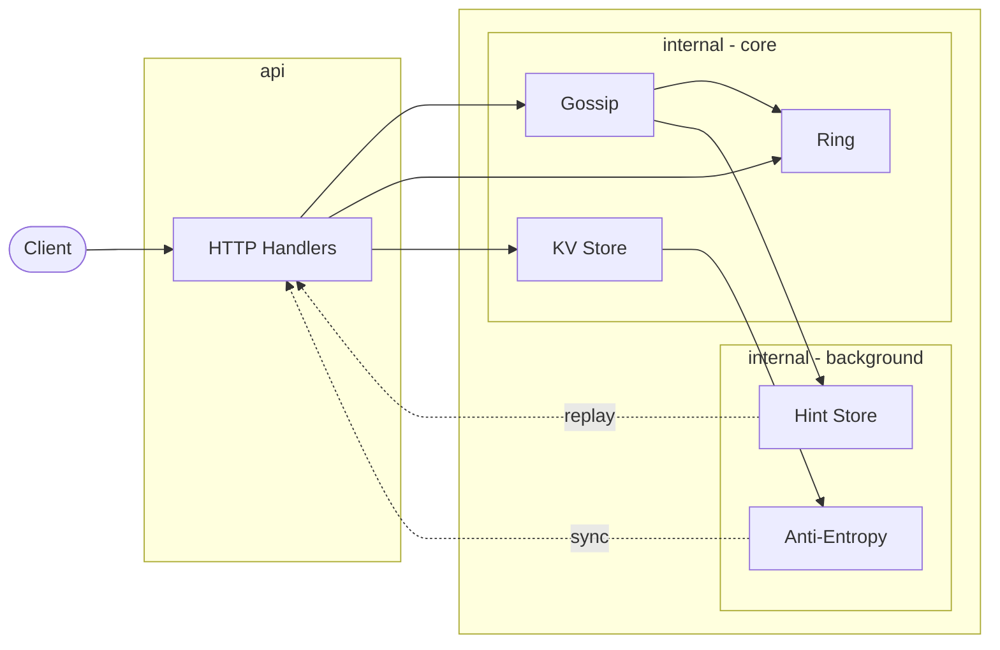

# Continuum

[](https://github.com/colingraydon/Continuum/actions/workflows/ci.yml)
[](https://github.com/colingraydon/Continuum/actions/workflows/codeql.yml)
[](https://codecov.io/gh/colingraydon/Continuum)
[](https://sonarcloud.io/project/overview?id=colingraydon_Continuum)
[](https://goreportcard.com/report/github.com/colingraydon/continuum)
[](https://go.dev)
[](LICENSE)

A distributed key-value store implementing the core data layer patterns from Cassandra and Dynamo - written in Go.

Continuum maps keys to nodes via a consistent hash ring, propagates cluster membership through a gossip protocol, fans writes to N replicas with quorum acknowledgment, surfaces concurrent writes as vector clock siblings rather than discarding them, and repairs divergent replicas through a combination of inline read repair, event-driven hinted handoff, and background Merkle tree anti-entropy.

---

## Architecture



| Layer | Package | Role |
| ----- | ------- | ---- |
| Hash Ring | `internal/ring` | Routes keys to nodes via consistent hashing with a Red-Black Tree and virtual nodes |
| Gossip | `internal/gossip` | Cluster membership and failure detection over UDP without a central coordinator |
| KV Store | `internal/store` | In-memory storage with vector clock versioning and tombstone deletes |
| Anti-Entropy | `internal/antientropy` | Background Merkle-tree comparison and bidirectional repair of divergent replicas |
| Hint Store | `internal/hintstore` | Durability buffer that replays missed writes when a down replica recovers |
| HTTP API | `api` | Transport, read repair, data migration, Prometheus instrumentation |

---

## Quick Start

**Single node**

```bash
make run
```

**Three-node cluster with Prometheus and Grafana**

```bash
make docker-run
```

| Service | Address |
| ------- | ------- |
| node1 | `http://localhost:8080` |
| node2 | `http://localhost:8082` |
| node3 | `http://localhost:8083` |
| Prometheus | `http://localhost:9090` |
| Grafana | `http://localhost:3000` (admin / admin) |

**Write and read a key**

```bash
curl -X PUT http://localhost:8080/keys/user:123 \
  -H "Content-Type: application/json" \
  -d '{"value": "alice"}'

curl http://localhost:8080/keys/user:123
```

**Development commands**

```bash
make test      # unit and integration tests
make e2e       # end-to-end tests (spawns real processes)
make bench     # benchmarks
make lint      # golangci-lint
make coverage  # HTML coverage report
```

---

## Documentation

| Doc | Contents |
| --- | -------- |
| [Architecture](docs/architecture.md) | System diagram, layer map, write and read path narratives |
| [Hash Ring](docs/ring.md) | RBT, murmur3, virtual nodes, weighted allocation, health filter |
| [Gossip](docs/gossip.md) | UDP transport, membership lifecycle, failure detection, convergence |
| [Replication](docs/replication.md) | Vector clocks, quorum, sibling surfacing, fan-out implementation |
| [Anti-Entropy](docs/antientropy.md) | Merkle trees, bidirectional sync, tombstone GC safety argument |
| [Hinted Handoff](docs/hinted-handoff.md) | Durability gap, hint lifecycle, event-driven delivery, graceful flush |
| [Read Repair](docs/read-repair.md) | Async repair, always-repair-on-conflict, X-Proxied-From path reuse |
| [Data Migration](docs/data-migration.md) | Pull on join, push on leave, bootstrapping state machine |
| [API Reference](docs/api.md) | All endpoints with request/response examples and internal headers |
| [Operations](docs/operations.md) | Env vars, Docker setup, Makefile targets, Prometheus metrics |
| [Benchmarks](docs/benchmarks.md) | Hash ring throughput and latency measurements |

---

## What's Next

- **Persistence** - write-ahead log and snapshot-on-shutdown so state survives restarts; a prerequisite for making the tombstone GC safety argument hold across node restarts
- **Benchmark coverage** - store, anti-entropy, gossip, and end-to-end latency benchmarks
- **Architecture diagram** - detailed system diagram in [docs/architecture.md](docs/architecture.md)
