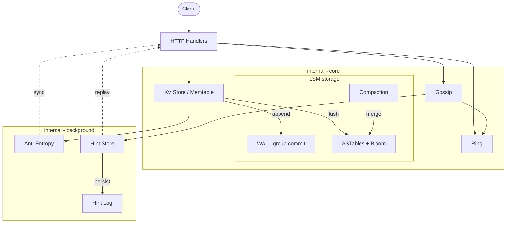

# Continuum

[](https://github.com/colingraydon/Continuum/actions/workflows/ci.yml)
[](https://github.com/colingraydon/Continuum/actions/workflows/codeql.yml)
[](https://codecov.io/gh/colingraydon/Continuum)
[](https://sonarcloud.io/project/overview?id=colingraydon_Continuum)
[](https://goreportcard.com/report/github.com/colingraydon/continuum)
[](https://go.dev)
[](LICENSE)
[](https://colingraydon.github.io/Continuum/)

**[Read the documentation site →](https://colingraydon.github.io/Continuum/)**

A distributed key-value store implementing the core data layer patterns from Cassandra and Dynamo - written in Go.

Continuum maps keys to nodes via a consistent hash ring, propagates cluster membership through a gossip protocol, fans writes to N replicas under a sloppy quorum whose consistency level is tunable per request from one to all, surfaces concurrent writes as vector clock siblings rather than discarding them, and repairs divergent replicas through a combination of inline read repair, event-driven hinted handoff, and background Merkle tree anti-entropy. With `DATA_DIR` set, the store runs as an LSM engine: every write goes through a CRC-checked write-ahead log whose fsyncs are batched across concurrent writers by group commit, the memtable flushes to immutable SSTables with bloom filters on a size threshold, and reads merge across generations, so state survives restart and the dataset is no longer RAM-bound on the write path. Buffered hints are persisted to their own append-only log, so undelivered writes survive a coordinator crash rather than depending on anti-entropy alone. Clients that want more than eventual consistency can opt in per request: conditional writes run a single-decree Paxos round per key (Cassandra-LWT style, with promises fsynced to their own log) and reject on clock mismatch instead of creating a sibling, serial reads ride the prepare phase for linearizability, and a session clock header buys read-your-writes and monotonic reads. A porcupine-based checker holds the CAS path to that claim: racing-client histories must linearize per key, through kills, restarts, and asymmetric partitions, in both the process-level fault harness and a seeded in-process simulation.

**18M** key routings/s &nbsp;·&nbsp; **7.6M** memtable reads/s &nbsp;·&nbsp; **1.4M** cached SSTable reads/s &nbsp;·&nbsp; **9.5K** quorum writes/s at **~100 µs** p50 &nbsp;·&nbsp; **7.5×** durable write throughput from group commit

<sub>One Apple M3 Max; exact percentiles in [docs/data](docs/data/benchmarks.json), method and full tables in [Benchmarks](docs/benchmarks.md).</sub>

---

## Architecture



| Layer | Package | Role |
| ----- | ------- | ---- |
| Hash Ring | `internal/ring` | Routes keys to nodes via consistent hashing with a Red-Black Tree and virtual nodes |
| Gossip | `internal/gossip` | Cluster membership and failure detection over UDP without a central coordinator |
| KV Store | `internal/store` | LSM engine: vector clock versioning, tombstone deletes, ordered skiplist memtable, flush, merged reads |
| WAL + SSTables | `internal/wal`, `internal/sstable` | Crash-durable append-only log with CRC framing; immutable sorted tables with bloom filters, per-block compression, and a shared block cache |
| Paxos CAS | `internal/paxos` | Single-decree consensus per key behind conditional writes and serial reads; promises persisted to their own log |
| Anti-Entropy | `internal/antientropy` | Background Merkle-tree comparison and bidirectional repair of divergent replicas |
| Hint Store | `internal/hintstore` | Durability buffer that replays missed writes when a down replica recovers |
| HTTP API | `api` | Transport, quorum fan-out, read repair, data migration, Prometheus instrumentation |

---

## Quick Start

**Single node**

```bash
make run
```

**Three-node cluster with Prometheus and Grafana**

```bash
make docker-run
```

| Service | Address |
| ------- | ------- |
| node1 | `http://localhost:8080` |
| node2 | `http://localhost:8082` |
| node3 | `http://localhost:8083` |
| Prometheus | `http://localhost:9090` |
| Grafana | `http://localhost:3000` (admin / admin) |

**Write and read a key**

```bash
curl -X PUT http://localhost:8080/keys/user:123 \
  -H "Content-Type: application/json" \
  -d '{"value": "alice"}'

curl http://localhost:8080/keys/user:123
```

**Development commands**

```bash
make test      # unit and integration tests
make e2e       # end-to-end tests (spawns real processes)
make fault     # fault-injection suite (kills, hangs, partitions, packet loss)
make sim       # seeded in-process cluster simulation (SIM_SEEDS=n to sweep)
make bench     # benchmarks
make lint      # golangci-lint
make coverage  # HTML coverage report
```

---

## Documentation

| Doc | Contents |
| --- | -------- |
| [Architecture](docs/architecture.md) | System diagram, layer map, write and read path narratives |
| [Hash Ring](docs/ring.md) | RBT, murmur3, virtual nodes, weighted allocation, health filter |
| [Gossip](docs/gossip.md) | UDP transport, membership lifecycle, failure detection, convergence |
| [Replication](docs/replication.md) | Vector clocks, sloppy quorum, per-request consistency levels, sibling surfacing, fan-out implementation |
| [Anti-Entropy](docs/antientropy.md) | Merkle trees, bidirectional sync, tombstone GC safety argument, tree snapshots on clean shutdown |
| [Hinted Handoff](docs/hinted-handoff.md) | Durability gap, hint lifecycle, event-driven delivery, graceful flush |
| [Persistence](docs/persistence.md) | WAL framing, snapshot format, recovery flow, downtime gate |
| [SSTable](docs/sstable.md) | Immutable sorted table format: compressed data blocks, sparse index, bloom filter, shared block cache |
| [Read Repair](docs/read-repair.md) | Async repair, always-repair-on-conflict, X-Proxied-From path reuse |
| [Client Consistency](docs/client-consistency.md) | Paxos-backed conditional writes, linearizable serial reads, and session guarantees: 412 on clock mismatch, X-Session-Clock, read escalation |
| [Range Scans](docs/range-scans.md) | Merged LSM prefix scan per node, scatter-gather coordinator, pagination horizon |
| [Backup and Restore](docs/backup-restore.md) | Hard-linked point-in-time table snapshots; restore through the existing recovery path |
| [Data Migration](docs/data-migration.md) | Pull on join, push on leave, bootstrapping state machine |
| [Fault Injection](docs/fault-injection.md) | Process-level fault harness: proxies, kill/hang/partition scenarios, durability and convergence invariants |
| [History Checking](docs/history-checking.md) | Porcupine linearizability verification of CAS histories; the churn-window violation it surfaced as finding #7 |
| [Simulation Testing](docs/simulation.md) | Whole cluster in one process behind a seeded in-memory network: generated fault schedules, compressed time, race-detector coverage |
| [Testing](docs/testing.md) | The full test pyramid: unit and fault-seam tests, randomized store model, in-process clusters, process E2E, fault injection |
| [API Reference](docs/api.md) | All endpoints with request/response examples and internal headers |
| [Operations](docs/operations.md) | Env vars, Docker setup, Makefile targets, Prometheus metrics |
| [Benchmarks](docs/benchmarks.md) | Full-stack measurements: ring, LSM store, group commit, Merkle sync, gossip codec, quorum round trips |
| [Design: Paxos CAS](docs/paxos-cas-design.md) | The design doc the consensus-backed CAS implementation followed: protocol, safety notes, wiring plan |

---

## What's Next

**Performance and storage**

- **Sharded store** - split the single store mutex into 256 shards; partially superseded by the LSM engine, so benchmark first to see whether it still pays
- **Streaming bootstrap and decommission** - node join pulls keys as one JSON batch per bucket and graceful shutdown materializes the entire dataset in memory for a single push per successor; replace both with chunked, resumable streaming so migration survives datasets larger than RAM
- **Read-time merge and leveled compaction** - the LSM currently folds older-generation state into the memtable on write so reads stop at the first generation hit, which forces size-tiered compaction over contiguous recency runs; moving the merge to the read path (k-way across tables) unlocks leveled compaction with bounded space amplification and early-terminating scans
- **Key-value separation (WiscKey)** - store large values in a dedicated append-only value log with SSTables holding keys plus pointers, cutting compaction write amplification; the hard parts are value-log garbage collection against live pointers and crash recovery across two logs
- **Backpressure and admission control** - nothing currently stops a compaction stall or slow replica from cascading; add write stalls with a real policy when flush falls behind, coordinator load shedding when fan-out queues grow, and overload signaling at the HTTP layer

**Correctness and verification**

- **TLA+ specification** - model the sloppy quorum, hinted handoff, read repair, and anti-entropy interaction and model-check the invariants the fault harness only samples (acknowledged writes survive F failures, tombstone GC never resurrects); stretch goal is trace conformance between harness events and the spec

**Data model**

- **CRDT sibling auto-merge** - Riak-style server-side data types (counter, set, LWW-register) so clients can opt out of manual sibling resolution
- **Key TTL** - per-key expiry; interacts with tombstones, compaction, and replica clock skew
- **Secondary indexes** - local per-node index maintained on write plus a scatter-gather query path, building on the range-scan machinery

**Cluster and operations**

- **Rack/DC-aware placement** - spread each key's replica set across failure domains instead of taking the next N distinct nodes on the ring
- **Multi-DC replication** - per-DC replica placement and LOCAL_QUORUM consistency levels, with asynchronous cross-DC replication and its own repair story; stresses ring topology metadata, gossip, and quorum math at once
- **Token-aware Go client** - a client library that hashes keys locally and talks directly to a replica, skipping the coordinator hop
