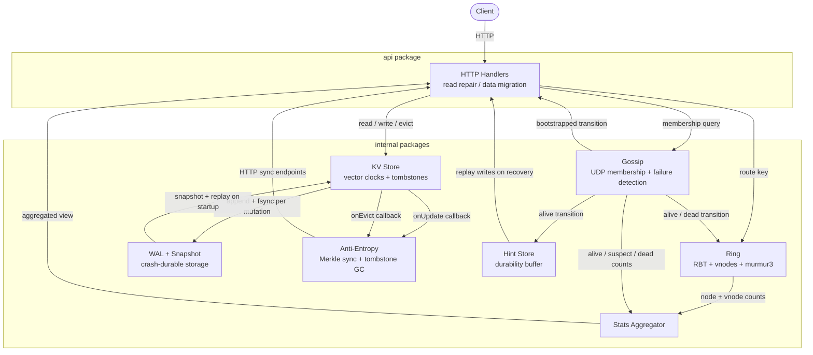

# Architecture

> A distributed key-value store built on consistent hashing, gossip-based membership, and vector clock conflict resolution.

## System Diagram

## Layers

| Layer | Package | Role |
| ----- | ------- | ---- |
| Hash Ring | `internal/ring` | Routes keys to nodes via consistent hashing |
| Gossip | `internal/gossip` | Membership, failure detection, cluster convergence |
| KV Store | `internal/store` | In-memory storage with vector clock versioning; optional WAL hook for durability |
| WAL + Snapshot | `internal/wal`, `internal/store/snapshot.go` | Append-only log with CRC framing + atomic snapshot file; reloaded on startup |
| Anti-Entropy | `internal/antientropy` | Background Merkle-tree repair of divergent replicas |
| Hint Store | `internal/hintstore` | Durability buffer for writes to temporarily-down replicas |
| Stats | `internal/stats` | Aggregates ring and gossip state into a single view |
| HTTP API | `api` | Transport, read repair, data migration, Prometheus metrics |

Each internal package has a strict boundary. The ring knows nothing about HTTP or membership. The gossip layer knows nothing about storage or replication. Wiring happens entirely in `main.go`.

## Write Path

A `PUT /keys/:key` call flows like this:

1. `metricsMiddleware` records latency and request count
2. `PutKey` handler decodes `{"value": "...", "clocks": {...}}`
3. The handler increments its own vector clock entry and writes to the local `Store`. With `DATA_DIR` set, the write is appended to the WAL and fsynced before the in-memory state is modified; a fsync failure returns 503 without fan-out.
4. `ring.GetReplicationNodes(key, factor)` returns the N-node replica set
5. Goroutines fan the write to each non-self replica with `X-Proxied-From` set
6. The coordinator waits for W acks - self counts as one - and returns 204 on quorum or 503 if quorum cannot be reached
7. In-flight goroutines that hadn't reported when quorum was met are drained by a background goroutine, which records hints for any failures

## Read Path

A `GET /keys/:key` call flows like this:

1. `GetNode` handler extracts the key
2. `ring.GetReplicationNodes(key, factor)` returns the replica set, excluding bootstrapping nodes
3. Goroutines fan the read to all replicas with `X-Proxied-From` set
4. The coordinator waits for R responses and merges all sibling sets into the canonical result
5. Any replica whose response is a proper subset of the merged result is repaired asynchronously in a background goroutine
6. The merged result is returned to the client

## Background Processes

Three background loops run on every node:

**Gossip loop** - every 1 second, each node increments its heartbeat, picks up to 3 random alive peers (fanout=3), and pushes its full member list to each. Membership changes propagate across the cluster in O(log n) rounds.

**Anti-entropy sync** - every 30 seconds, one vnode is selected at random and its Merkle tree is compared against each replica. Divergent buckets are reconciled bidirectionally.

**Tombstone GC** - every 5 minutes, uncontested tombstones older than 1 hour are purged from the store and from the primary's Merkle trees.

A fourth loop runs per node: **hint expiry** checks every 5 minutes for hints older than 1 hour and discards them, deferring to anti-entropy for any keys that were not replayed in time.

## Dependency Rules

- `internal/ring`, `internal/store`, `internal/gossip`, `internal/hintstore`, `internal/merkle` have no imports from other internal packages
- `internal/antientropy` imports `ring`, `store`, and `merkle`
- `internal/stats` imports `ring` and `gossip`
- `api` imports all internal packages
- Wiring and configuration live entirely in `cmd/continuum/main.go`

This structure means every internal package is independently testable without mocking the rest of the system.
